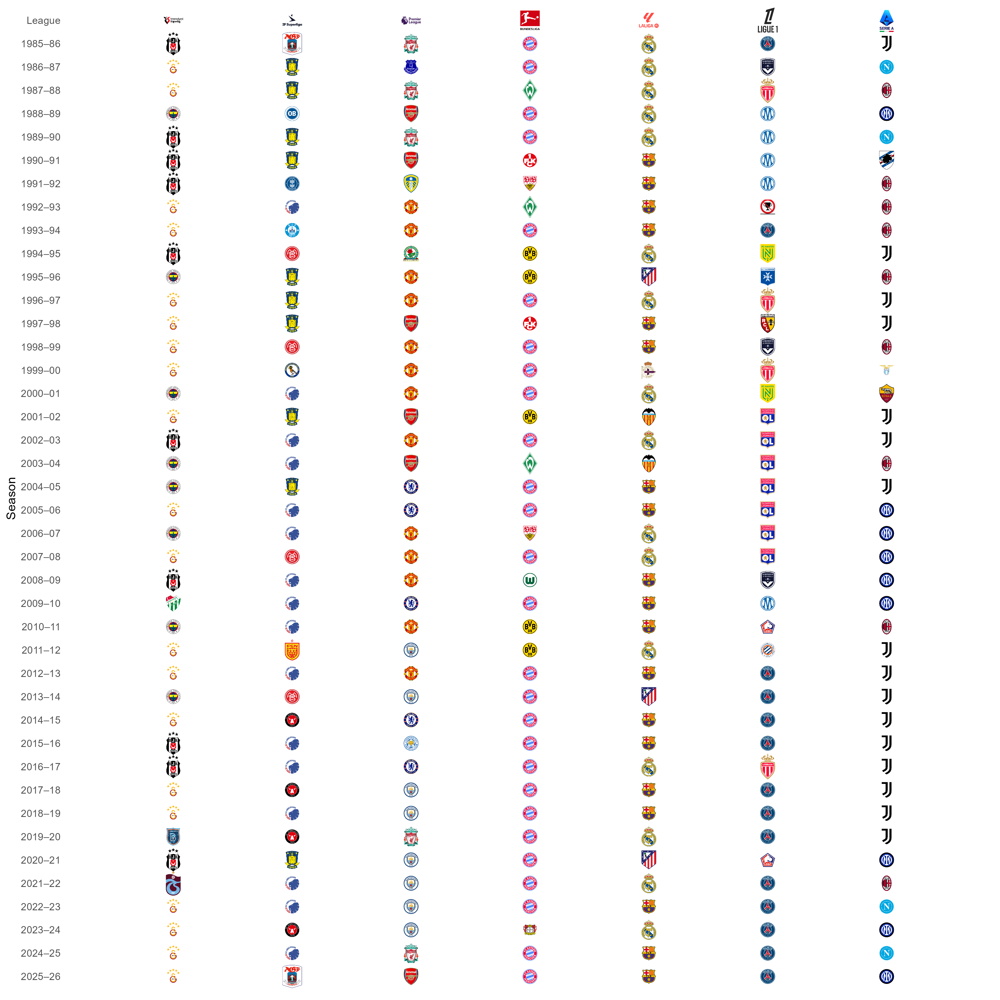

# Champions of Different Leagues

This project visualizes the champions of seven major European football leagues from the 1985-1986 season onwards. The leagues included are:

- Premier League (England)
- Bundesliga (Germany)
- Serie A (Italy)
- Ligue 1 (France)
- La Liga (Spain)
- Danish Superliga (Denmark)
- Turkish Super Lig (Turkey)

## Motivation

The inspiration for this project comes from AGF's remarkable achievement: after winning the Danish Superliga in 1986, they claimed the title again 40 years later.

## Data & Visualization

- **Data:** Champions and their logos were collected manually for each league and season from 1985-1986 onwards.
- **Visualization:** The graph below displays each season's champion for every league, with league logos at the top and club logos marking each season's winner.

